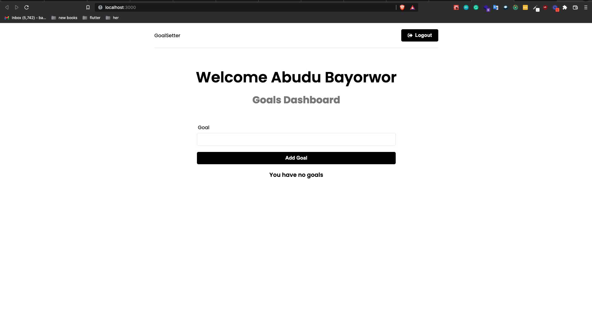
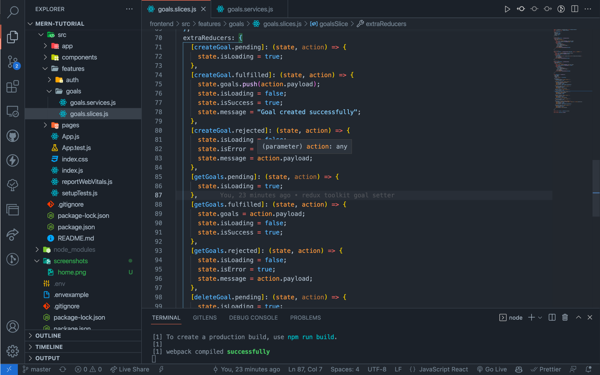

# Mern goals setter with redux toolkit

Goals setter is a simple app that allows you to set your goals and see your progress.
It is built with [redux toolkit](https://redux-toolkit.js.org/) and [react-redux](https://react-redux.js.org/) libraries.
It also uses [react-router-dom](https://reacttraining.com/react-router/web/api/BrowserRouter) library to handle routing.
The backend is built with [Node.js](https://nodejs.org/en/) and [Express.js](https://expressjs.com/en/api.html).

### Visuals of the app

<p> Home page </p>



<p>Sample Redux slice:</p>


### Frameworks and Libraries

- [React](https://reactjs.org/)
- [Node.js](https://nodejs.org/)
- [Express.js](https://expressjs.com/)
- [Redux](https://redux.js.org/)
- [Redux-toolkit](https://redux-toolkit.js.org/)
- [React-router-dom](https://reacttraining.com/react-router/web/api/BrowserRouter)
- [React-toastify](https://npmjs.com/package/react-toastify)

## Features

- [create account](#create-account)
- [login](#login)
- [logout](#logout)
- [set goals](#set-goals)
- [see goals](#see-goals)
- [see progress](#see-progress)
- [see history](#see-history)
- [see all goals](#see-all-goals)
- [delete goals](#delete-goals)

## Installation

Use the package manager [npm](https://www.npmjs.com/) to install all the packages.

```bash
npm install <nameOfPackage>
```

## Usage

### To use the payment gateway

```bash
git clone <name of projects>

cd <name of projects>

npm install

cd frontend

cd ..

npm install

npm run dev
```

## Testing

### To test the payment gateway

```bash
npm run test
```

## Contributing

Pull requests are welcome. For major changes, please open an issue first to discuss what you would like to change.

Please make sure to update tests as appropriate.

## License

[MIT](https://choosealicense.com/licenses/mit/) license

## Badges

[](https://travis-ci.org/shortway/merchant-dashboard)
[](https://badge.fury.io/js/shortway)
[](https://badge.fury.io/js/shortway)
